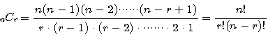
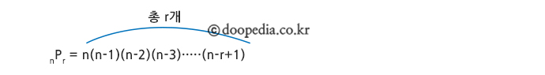

# 조합, 순열 구현하기

python에서 조합, 순열을 구현하는 방법을 정리해봤다. `itertools` 모듈 사용법 뿐만 아니라 재귀를 이용하여 직접 구현하는 방법까지 알아보겠다.


## 💡 조합
📌 서로 다른 n개 중에서 r개(n≥r) 취하여 조를 만들 때, 이 하나하나의 조를 n개 중에서 r개 취한 조합


- 구현
```python
from itertools import combinations
a = [1, 2, 3]
print(list(combinations(a, 2)))

# 출력 : [(1, 2), (1, 3), (2, 3)]
```

## 💡 중복 조합
📌 n개인 것 중에서 r개 취하는 조합에서 중복을 취하는 것
`nHr=n+r−1Cr`


## 💡 순열
📌 서로 다른 n 개 중 r 개를 골라 순서를 고려해 나열한 경우의 수.


- 구현
```python
from itertools import permutations
a = [1, 2, 3]
print(list(permutations(a, 2)))

# 출력 : [(1, 2), (1, 3), (2, 1), (2, 3), (3, 1), (3, 2)]
```

## 💡 중복 순열
- 구현
```python
from itertools import product
a = [1, 2, 3]
print(list(product(a, repeat=2)))
# 출력 : [(1, 1), (1, 2), (1, 3), (2, 1), (2, 2), (2, 3), (3, 1), (3, 2), (3, 3)]
```


## Reference
- [조합](https://terms.naver.com/entry.naver?docId=1223702&cid=40942&categoryId=32213)
- [순열](https://terms.naver.com/entry.naver?docId=1223701&cid=40942&categoryId=32213)
- https://juhee-maeng.tistory.com/91