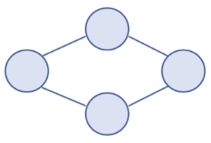
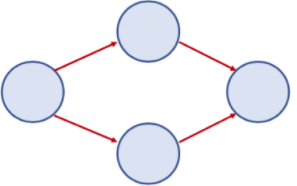
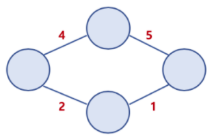
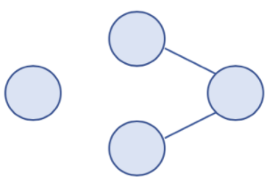
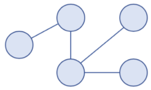
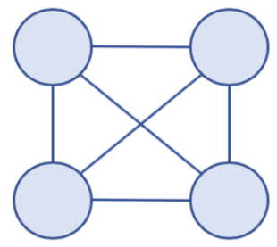
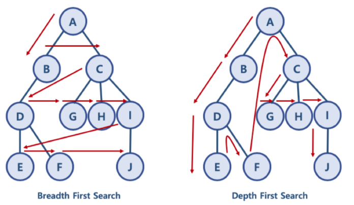

## 그래프

### 정의
- 실제 세계의 현상이나 사물을 정점(vertex) or 노드(node)와 간선(edge)으로 표현하기 위해 사용되는 구조.

### 용어
- 노드(node) : 위치. = 정점(vertex)
- 간선(edge) : 위치 간의 관계를 표시한 선. 노드 간 연결 선. = link, branch
- 인접 정점(adjacent vertex) : 간선으로 직접 연결된 정점

### 종류

- **무방향 그래프(Undirected Graph)**
    - 방향이 없는 그래프. 간선을 통해 노드는 양방향으로 갈 수 있다.
    - 표기 : (A,B) or (B,A) 


- **방향 그래프(Directed Graph)**
    - 간선에 방향이 있는 그래프
    - 표기 : <A, B>


- **가중치 그래프(Weighted Graph or Nerwork)**
    - 간선에 비용 또는 가중치가 할당된 그래프


- **연결(Connected), 비연결(Disconnected) 그래프**
    - Connected Graph : 무방향 그래프에 있는 모든 노드에 대해 항상 경로가 존재하는 경우
    - Disconnected Graph : 무방향 그래프에 있는 특정 노드에 대해 경로가 존재하지 않는 경우


- **순환(Cycle), 비순환(Acycle) 그래프**
    - Cycle Graph : 단순 경로(처음 정점과 끝 정점을 제외하고 중복된 정점이 없는 경로)의 시작 노드
와 종료 노드가 동일한 그래프
    - Acyclic Graph : 사이클이 없는 그래프


- **완전 그래프(Complete Graph)**
    - 그래프의 모든 노드가 서로 연결된 그래프



### 그래프와 트리의 차이
트리는 그래프에 속한다.

|   | 그래프 | 트리 |
|:--|:--|:--|
| 정의 | 노드와 노드를 연결하는 간선으로 표현되는 자료구조 | 그래프의 한 종류. 방향성이 있는 비순환 그래프 | 
| 방향성 | 무방향, 방향 둘다 O | 방향만 O |
| 사이클 | 둘다 O | 사이클 X |
| 루트 노드 | 루트 노드 X | 루트 노드 O |
| 부모/자식 관계 | 부모 자식 개념 X | 부모 자식 관계 O |


## DFS 


### 정의
- Depth First Search.
- 깊이 우선 탐색. 정점의 자식들을 먼저 탐색하는 방식이다.

### 시간 복잡도
O(노드 수 + 간선 수)

### 구현
```python
def dfs(graph, start_node):
    visited, need_visit = list(), list()
    need_visit.append(start_node)
    while need_visit:
        node = need_visit.pop()
        if node not in visited:
            visited.append(node)
            need_visit.extend(graph[node])
```

## BFS

### 정의
- Breadth First Search
- 너비 우선 탐색. 정점의 형제 노드들을 먼저 탐색하는 방식

### 시간 복잡도
O(노드 수 + 간선 수)

### 구현
```python
def bfs(graph, start_node):
    visited, need_visit = list(), list()
    need_visit.append(start_node)
    while need_visit:
        node = need_visit.pop(0)
        if node not in visited:
            visited.append(node)
            need_visit.extend(graph[node])
```