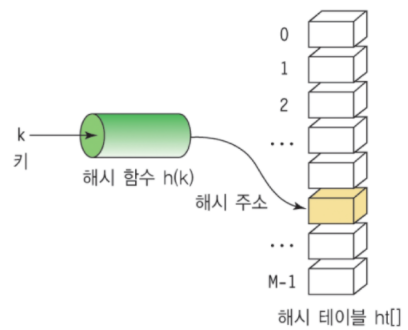

## 해쉬 테이블

### 정의
- Key에 Value를 저장하는 데이터 구조.
- key를 통해 바로 데이터를 받아올 수 있으므로 탐색 속도가 빨라짐

### 용어
- **hash** : 임의 값을 고정 길이로 변환하는 것
- **hash table** : key 값 연산에 의해 직접 접근이 가능한 데이터 구조
- **hashing function** : key에 대한 연산을 하여 데이터 위치를 주는 함수

### 충돌(Collision) 해결 알고리즘

- **Chaining 기법** 
충돌이 일어나면 링크드리스트를 이용하여, 데이터를 추가로 뒤에 연결 시켜 사용하는 기법
- **Linear Probing 기법** 
충돌이 일어나면 해당 hash address 다음 address부터 맨 처음 나오는 빈공간에 저장하는 기법

### 시간 복잡도
- 최선 : O(1)
- 최악(Collsion이 모두 발생하는 경우) : O(N)
