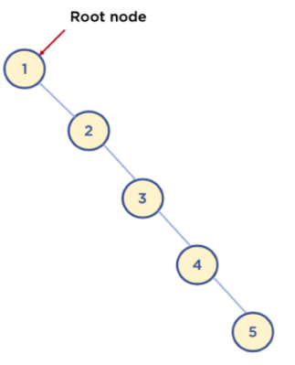

## 트리

### 정의
- Node와 Branch 를 이용해서, 사이클을 이루지 않도록 구성한 데이터 구조.
- 이진 트리를 이용한 검색 알고리즘에 많이 사용된다.

### 그래프와 트리의 차이
트리는 그래프에 속한다.

|   | 그래프 | 트리 |
|:--|:--|:--|
| 정의 | 노드와 노드를 연결하는 간선으로 표현되는 자료구조 | 그래프의 한 종류. 방향성이 있는 비순환 그래프 | 
| 방향성 | 무방향, 방향 둘다 O | 방향만 O |
| 사이클 | 둘다 O | 사이클 X |
| 루트 노드 | 루트 노드 X | 루트 노드 O |
| 부모/자식 관계 | 부모 자식 개념 X | 부모 자식 관계 O |

### 이진 탐색 트리
- 이진 트리: 노드의 최대 Branch 가 2인 트리
- 이진 탐색 트리 : 이진 트리 중, 왼쪽 자식 노드가 항상 부모 노드보다 값이 작고, 오른쪽 노드는 부모 노드보다 값이 큰 트리.

### 이진 탐색 트리의 시간 복잡도
- 최선 : O(logN)
- 최악 : O(N)

## Reference
- https://www.fun-coding.org/Chapter10-tree.html